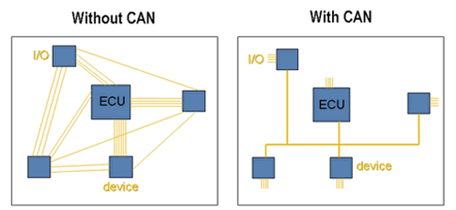

# PWM and CAN

You may have noted that the roboRIO has many ports and slots, each one labeled differently. These ports are used for communicating with other micro-controllers and devices.

### ➠ PWM

Pulse Width Modulation, or PWM, is a technique for getting analog results with digital means. Digital control is used to create a square wave, a signal switched between on and off. This on-off pattern can simulate voltages in between full on (5 Volts) and off (0 Volts) by changing the portion of the time the signal spends on versus the time that the signal spends off. The duration of "on time" is called the pulse width. To get varying analog values, you change, or modulate, that pulse width. If you repeat this on-off pattern fast enough with an LED for example, the result is as if the signal is a steady voltage between 0 and 5v controlling the brightness of the LED. (Hirzel)

**Video**

<iframe width="560" height="315" src="https://www.youtube-nocookie.com/embed/Lf7JJAAZxEU?rel=0" frameborder="0" allowfullscreen></iframe>

### ➠ CAN

Controller Area Network, or CAN bus, is a standard for communicating micro-controllers and devices without the need of a host computer. It was invented by Robert Bosh in the 1980s and has been used in both the automotive and aeronautic industry.

**Image**

**Video**

<iframe width="420" height="315" src="https://www.youtube-nocookie.com/embed/fTWp6bFIt0s?rel=0" frameborder="0" allowfullscreen></iframe>
