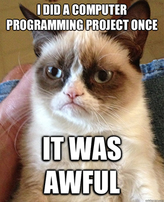
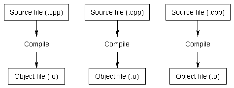
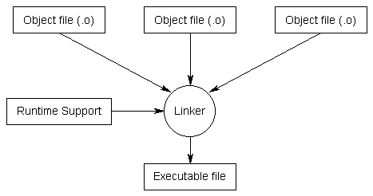

# Introduction to Software Development

**Note**: This section was based on [this](http://www.learncpp.com/cpp-tutorial/04-introduction-to-development/) article. I highly recommend you to read it as en extension to this course.

Before we can do any coding, we must first understand how a computer program is developed.

Here is a graphic outlining the general approach:

### Step 1 ➠ What?

What do you want to do? Do you want to make a game or do you want to control a robot? This step is the most important. You must have a well defined idea before going to the next step.

### Step 2 ➠ How?

Here, you need to think about how to solve your problem. In other words, you **plan before you code**. Its very common to have a programmer that has an awesome idea, begins writting a program, and gets lost somewhere in the middle. We all have been through there. Remember the KISS thing that I talked about earlier? This is the place to apply your KISS knowledge!

A good solution will be:
- Simple, **no black magic invovled (please!)**
- Easy to implement, **simple and stupid**
- Easy to change/extend, **it must be modular, in the programming world, everything is made of small things**
- Well documented, **it must be easy to understand by humans, not computers**

### Step 3 ➠ Implementation

If *step 2* is done correctly, this will be easy. If you jumped straight in from *Step 1* to this step, you may end up with this:

### Step 4 ➠ Compilation

**Compilation** refers to the process of transforming your code into binary files known as **object files**. This process can be tought of as "tranlating" C++ code into machine code.

The simplified process of compiling is:

1. Check that your code meets the C++ syntax rules
2. Check for pre-processors and act as needed, I will explain later.
3. Optimize the code
4. Translate the C++ code into Assembly
5. Translate Assembly intro machine code
6. Save the generated machine code in a *.o file on the hard disk

Here's a graphic for you to enjoy:

In complex projects, its very common to find a *Makefile*, which is a set of rules that tells your system how to compile your project. But thats a different topic...

Basically, these files are ready to be executed, but there is still one more step:

### Step 5 ➠ Linking

This process refers to taking all the object files and putting them into a executable. The resulting file is what we know as computer programs.

The basic process of the linker is:

1. Take all the object files and put them into an executable
2. Modify the executable to add run time support libraries
3. Modify the executable to notify the system which libraries (DLL in Windows, SO in UNIX) it needs to run.

Here is a nice graphic explaining this process:

### Step 6 ➠ Testing and debugging

This can be the most fun part or the most frustrating part. Here, you will run your program so many times that you will get sick of it. This is one of the most important steps in software development, because it allows you to ensure that your program is bug-free and will behave as expected. Think of it as "polishing" your program.

#### You as a programmer, must convince the rest of the team to give you and your fellow programmers time to test your software on the robot. You must test your program in order to ensure that the robot behaves as expected. You don't want surprises in the field.

