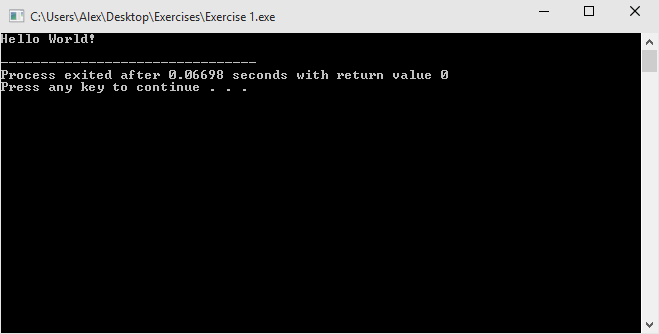

# Structure of a Program

As seen before, the best way to learn programming is by writing programs. One of the most common practices is to write a "Hello World" program, which simply prints "Hello World" in your screen.

First, create a new file with the following contents:

    // My first program!
    #include <iostream>
    
    int main()
    {
        std::cout << "Hello World!" << std::endl;
        return 0;
    }
    
Compile your program, when finished, the console screen should say:

    Hello World!
    
For reference, here is a screenshot:

