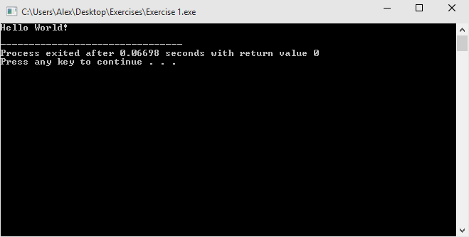

# Structure of a Program

As seen before, the best way to learn programming is by writing programs. One of the most common practices is to write a "Hello World" program, which simply prints "Hello World" in your screen.

First, create a new file with the following contents:

    // My first program!
    #include <iostream>
    
    int main()
    {
        std::cout << "Hello World!" << std::endl;
        return 0;
    }
    
Compile your program, when finished, the console screen should say:

    Hello World!
    
For reference, here is a screenshot:

# Analysis of our program

    1. // My first program!
    2. #include <iostream>
    3. 
    4. int main()
    5. {
    6.    std::cout << "Hello World!" << std::endl;
    7.    return 0;
    8. }
    
Line 1: <code>// My first program</code>

Two slash signs indicate that the rest of the line is a comment inserted by the programmer. It has no effect on the behavior of the program. Programmers use them to include short explanations or observations concerning the code or program. In this case, it is a brief introductory description of the program.

Line 2: <code>#include &lt;iostream&gt;</code>

Lines beginning with a hash sign (#) are directives read and interpreted by what is known as the preprocessor. They are special lines interpreted before the compilation of the program itself begins. In this case, the directive #include <iostream>, instructs the preprocessor to include a section of standard C++ code, known as header iostream, that allows to perform standard input and output operations, such as writing the output of this program (Hello World) to the screen.

Line 3: Blank line

A blank line has one effect on the behaviour of the program. They are used only for readibility purposes.

Line 4: <code>int main()</code>

This line initiates the declaration of a function. Essentially, a function is a group of code statements which are given a name: in this case, this gives the name "main" to the group of code statements that follow. Functions will be discussed in detail in a later chapter, but essentially, their definition is introduced with a succession of a type (int), a name (main) and a pair of parentheses (()), optionally including parameters.

The function named main is a special function in all C++ programs; it is the function called when the program is run. The execution of all C++ programs begins with the main function, regardless of where the function is actually located within the code.

